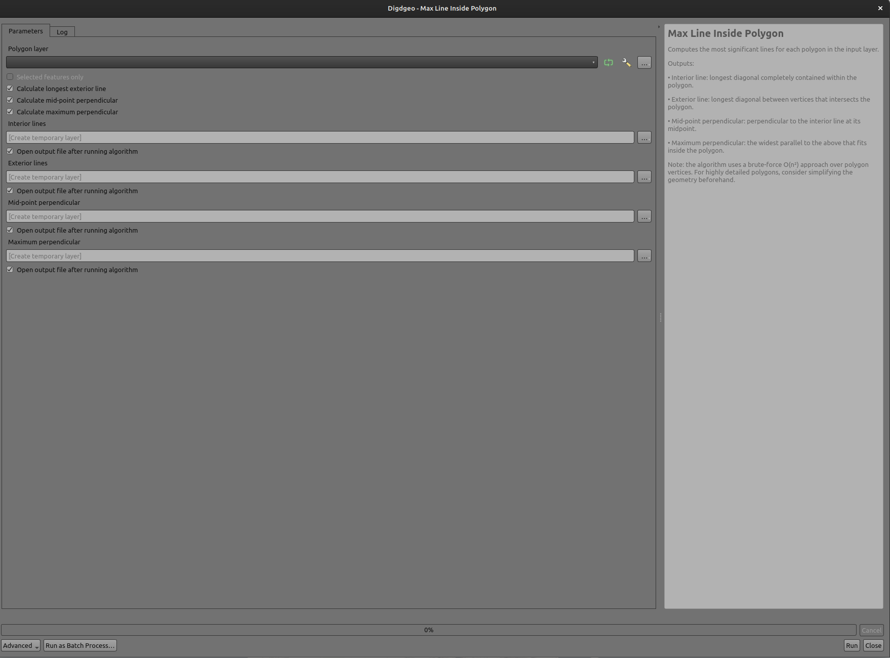
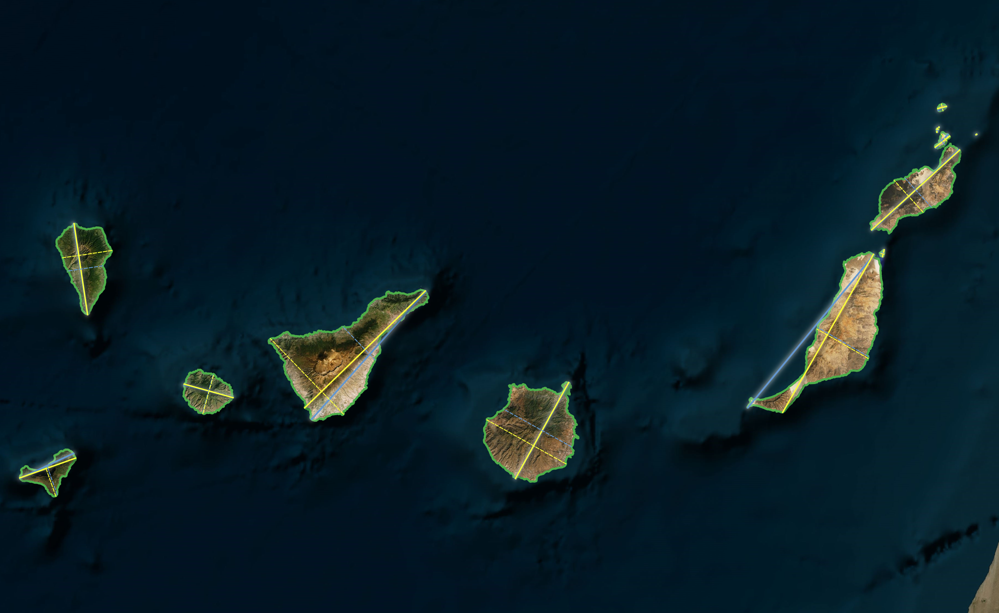
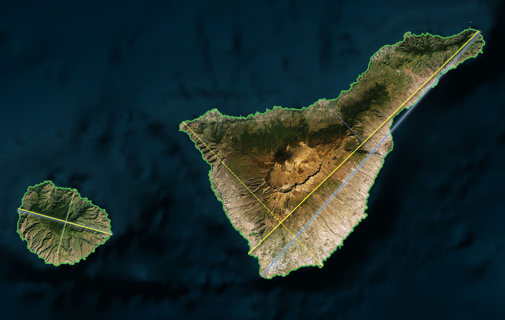
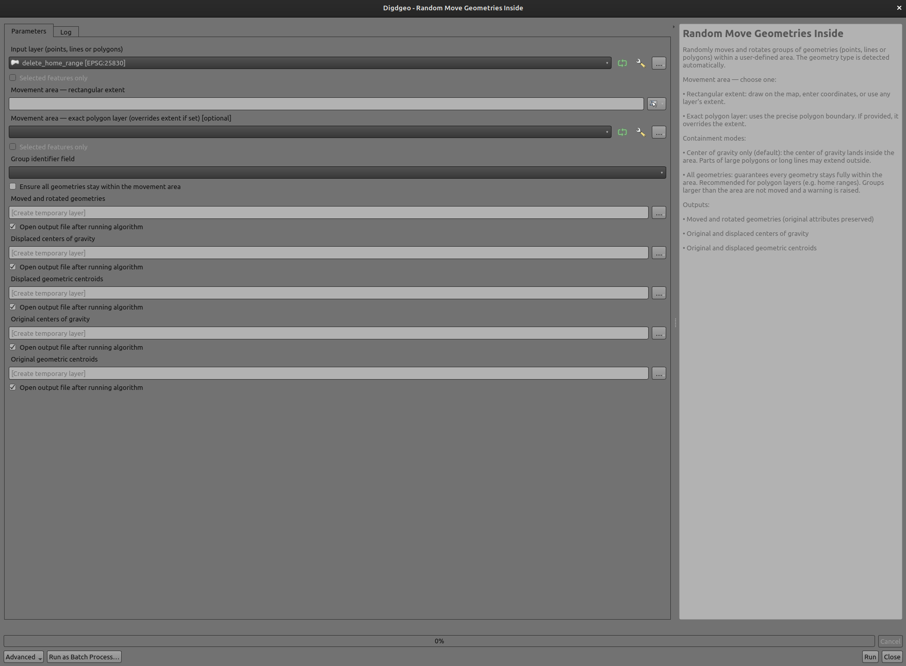
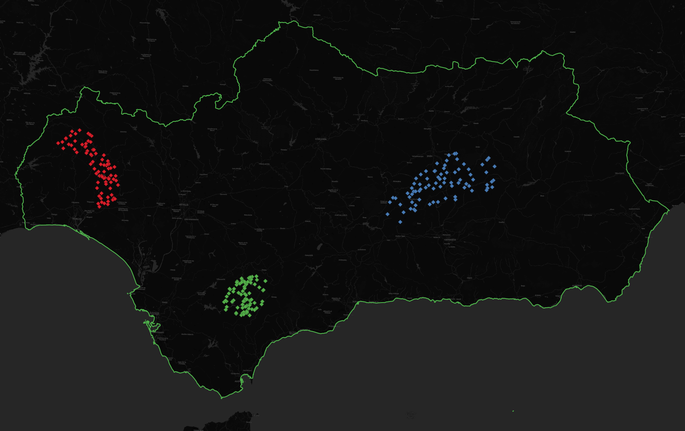
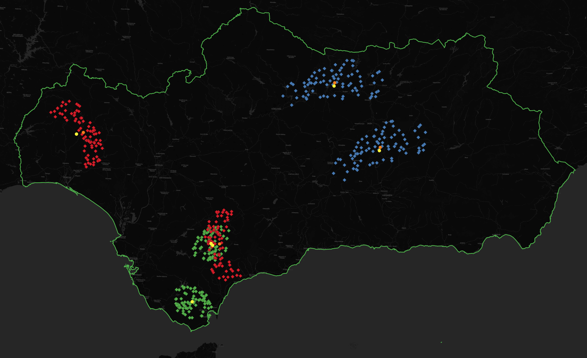
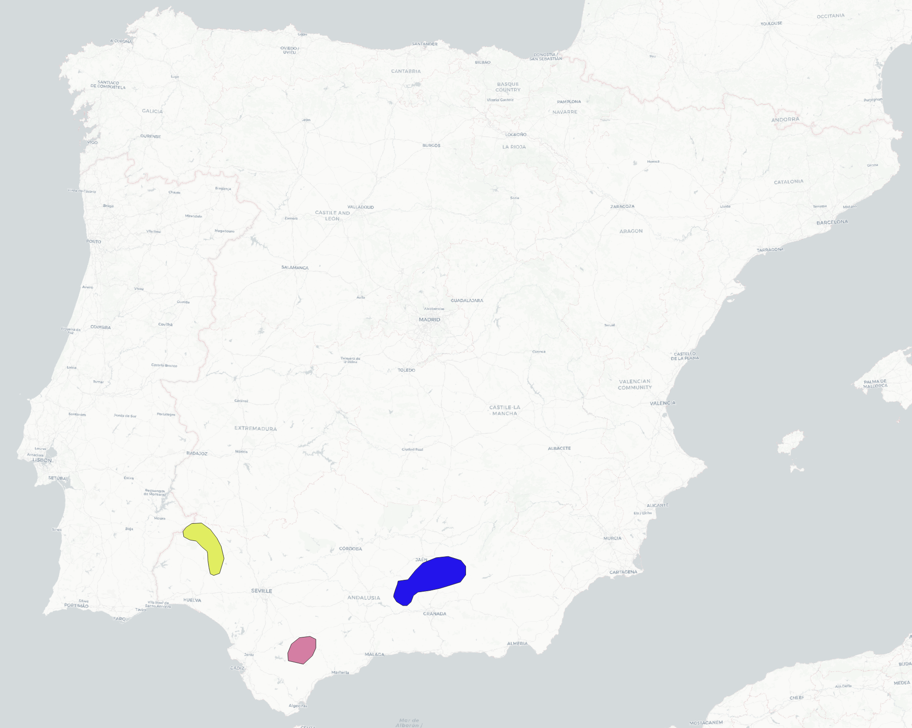
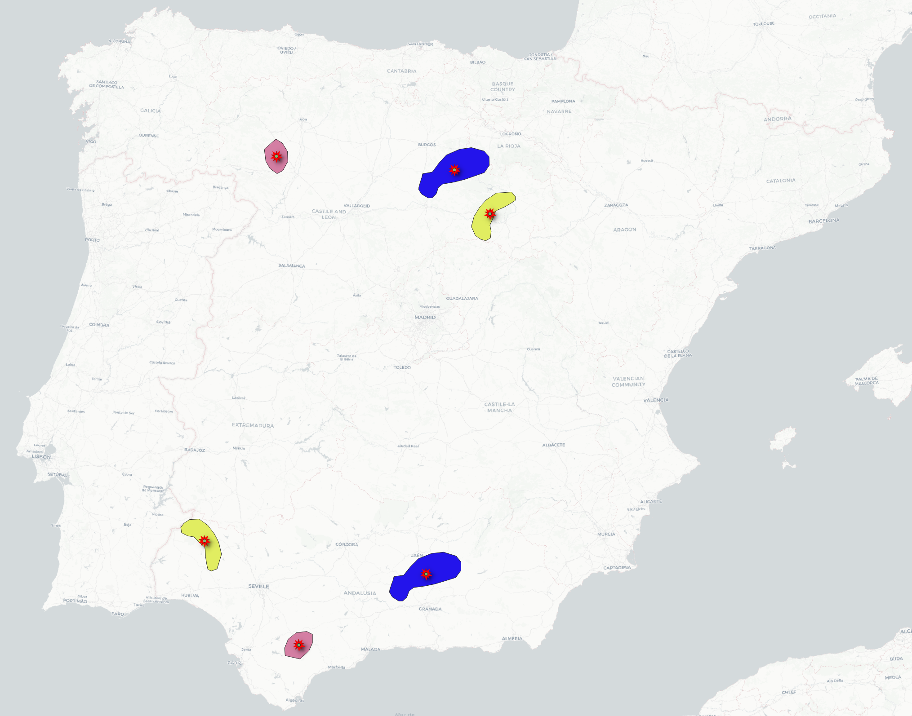

# QGIS Research Tools

A collection of QGIS Processing algorithms aimed at spatial analysis and research workflows.
These tools are designed to complement the existing **Research Tools** group in the QGIS Processing Toolbox,
and are being developed with the goal of contributing them to the official QGIS codebase.

---

## Tools

### 1. Max Line Inside Polygon (`mlip_qgis.py`)

Computes the most significant lines for each polygon in a vector layer:

| Output | Description |
|--------|-------------|
| **Interior line** | Longest diagonal completely contained within the polygon (connects two vertices) |
| **Exterior line** | Longest diagonal between vertices that intersects but is not fully inside the polygon |
| **Mid-point perpendicular** | Perpendicular to the interior line, clipped to the polygon boundary |
| **Maximum perpendicular** | The parallel to the above with the greatest length inside the polygon (maximum width) |

> **Performance:** the algorithm compares all unique vertex pairs within each polygon (O(n²) complexity).
> The number of comparisons is `n × (n-1) / 2`, so a polygon with 1,000 vertices produces ~500,000 comparisons.
> For detailed polygons (e.g. municipal boundaries), **run a simplification first** (*Vector → Geometry Tools → Simplify*) to reduce vertex count before using this tool.

> **MultiPolygon features:** only the largest part of each MultiPolygon is processed.
> If you need all parts to be analysed individually, **explode the layer first** (*Vector → Geometry Tools → Multipart to Singleparts*) so that each polygon becomes a separate feature.



**Example — Canary Islands:**


*Input: Canary Islands polygons.*


*Results: interior lines (orange), exterior lines (blue) and perpendiculars for each island.*


*Detail of Tenerife and La Gomera showing all four outputs.*

---

### 2. Random Move Geometries Inside (`rmpi_qgis.py`)

Takes a vector layer — **points, lines or polygons** — where each feature belongs to a group
(identified by a field) and randomly moves and rotates each group within a user-defined area.
The geometry type is detected automatically.

For each group the algorithm:
1. Computes the **center of gravity (CoG)** and the **geometric centroid (CC)**, then rotates all geometries around the CoG.
2. Picks a random rotation angle (0–360°) and applies it around the CoG.
3. Calculates a random displacement that places the group inside the movement area.
4. Applies the translation.

**How CoG and CC are computed by geometry type:**

| Geometry | Center of gravity (CoG) | Geometric centroid (CC) |
|----------|------------------------|------------------------|
| **Points** | Arithmetic mean of all point coordinates. Each point counts equally as one observation. | Center of the group's bounding box. Useful when the point cloud has outliers that skew the mean. |
| **Lines** | Mean of each line's geometric centroid (midpoint by length, invariant to vertex density). | Center of the bounding box of those centroids. |
| **Polygons** | Mean of each polygon's geometric centroid (centre of mass by area, invariant to vertex density). | Center of the bounding box of those centroids. |

> **Note for lines and polygons:** when each group contains a single feature (e.g. one home range polygon
> per individual), CoG and CC will always coincide — both equal the geometric centroid of that feature.
> The mean of vertex coordinates is intentionally avoided for lines and polygons, since vertex density
> is not uniform and would bias the result toward densely sampled sections.

**Containment modes:**

| Mode | Behaviour | Best for |
|------|-----------|----------|
| **Center of gravity only** (default) | Ensures the center of gravity lands inside the area. Individual geometries — especially large polygons or long lines — may partially extend outside. | Point clouds, small features |
| **All geometries** | Rotates the group first, derives the valid displacement range from the bounding box of the rotated union, and guarantees no geometry goes outside. If the group is larger than the area, it is not moved and a warning is raised. | Polygons (e.g. home ranges), lines |

> **Note for polygon layers:** in *center of gravity* mode, polygon borders can extend beyond the
> area boundary. If you need all geometries fully contained — for example when working with
> home range polygons — enable the *All geometries* option.

**Outputs:**
- Moved and rotated geometries (original attributes preserved)
- Displaced centers of gravity
- Displaced geometric centroids
- Original centers of gravity
- Original geometric centroids



**Example — point clouds (bird observation groups, Andalusia):**


*Input: three groups of observation points inside Andalusia.*


*Results: groups randomly moved and rotated. Orange dots show the original centers of gravity.*

**Example — home range polygons (Spain):**


*Input: three home range polygons distributed across Spain.*


*Results: polygons randomly moved and rotated within the extent, with centers of gravity shown.*

---

## Installation

1. Copy the `.py` file(s) into your QGIS Processing scripts folder:
   ```
   ~/.local/share/QGIS/QGIS3/profiles/default/processing/scripts/   # Linux / macOS
   %APPDATA%\QGIS\QGIS3\profiles\default\processing\scripts\        # Windows
   ```
2. In QGIS, open the **Processing Toolbox** and click **Scripts → Reload scripts**.
3. The tools will appear under the **Digdgeo** group.

### Requirements

These scripts run inside the QGIS Python environment and require:

| Package | Included with QGIS |
|---------|-------------------|
| `shapely` | ✅ Yes (≥ 1.8) |
| `numpy` | ✅ Yes |

No additional installation is needed.

---

## Usage

### Max Line Inside Polygon

| Parameter | Type | Description |
|-----------|------|-------------|
| Polygon layer | Vector (Polygon) | Input layer. MultiPolygon features are supported (largest part is used). |
| Calculate exterior line | Boolean | Default: `True` |
| Calculate mid-point perpendicular | Boolean | Default: `True` |
| Calculate maximum perpendicular | Boolean | Default: `True` |

---

### Random Move Geometries Inside

| Parameter | Type | Description |
|-----------|------|-------------|
| Input layer | Vector (Point / Line / Polygon) | Input layer. Geometry type is detected automatically. Must contain a group identifier field. |
| Movement area — rectangular extent | Extent | Drawn on the map, entered manually, or taken from any loaded layer's extent. |
| Movement area — exact polygon layer | Vector (Polygon) | If provided, uses the precise polygon boundary instead of the extent rectangle. |
| Group identifier field | Field | Field that identifies which group each feature belongs to. Default: `ID_progres`. |
| All geometries inside area | Boolean | Default: `False` (center of gravity mode). Set to `True` to guarantee all geometries remain fully within the area. Recommended for polygon layers. |

---

## Roadmap

- [ ] Add remaining scripts (in progress)
- [ ] Write unit tests
- [ ] Package as a QGIS plugin
- [ ] Submit to the QGIS **Research Tools** processing provider

---

## Contributing

Issues and pull requests are welcome.
If you use these tools in your research or work, feedback on edge cases and performance is especially appreciated.

---

## License

[GPL-2.0](https://www.gnu.org/licenses/old-licenses/gpl-2.0.html) — same as QGIS itself, consistent with the goal of contributing to the official codebase.
